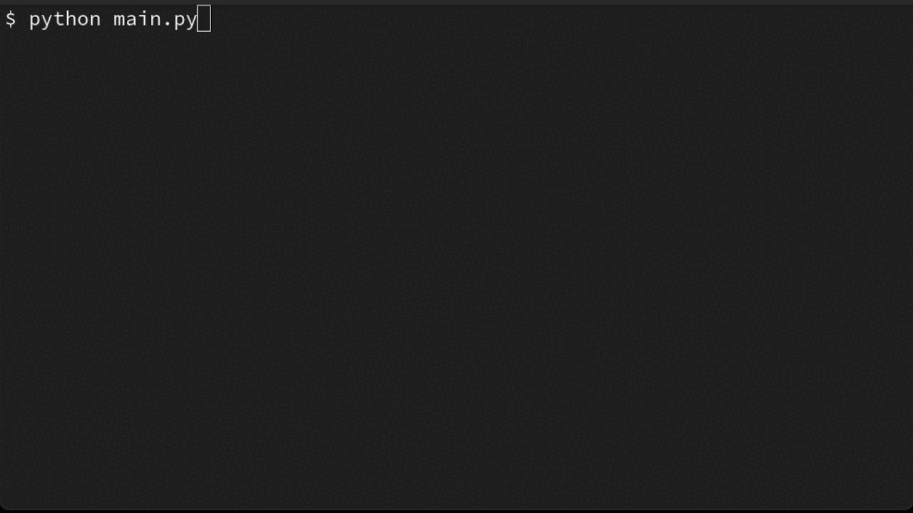

# Python Progress Bar

## Introduction

This repo contains a simple progress bar for Python.
It is a simple class that can be used to display a progress bar in the console, and is useful for long running tasks that you want to keep track of.

It's similar to the `tqdm` package, but is much simpler and has no dependencies beyond an ANSI-complient console.

## Features

 - Implements an iterable, so you can use it in a for loop.
 - Unicode-like progress bar, with an automatic width.
 - Displays the percentage, and estimated time remaining.
 - Wraps around stdout, which makes it possible to print other things to the console while the progress bar is running (which breaks `tqdm`).
 - Does not show any ANSI sequences when the output is not a tty.
 - Automatically adjusts the width of the progress bar to fit the console when resized.

 ## Usage

 There are no pip packages for this, so you will need to copy the `ptogress_bar.py` file into your project.

 ```python
from progress_bar import ProgressBar
import time

print("This is a text printed before the progress bar.")
time.sleep(1)

for i in ProgressBar(range(10)):
    print(f"Doing some computation for i={i}... ", end="")
    time.sleep(0.1)
    print("Done!")
    time.sleep(0.1)

print("This is a text printed after the progress bar.")

print("\n\nRunning the progress bar with a context manager.")
with ProgressBar() as progress:
    for i in range(10):
        print(f"Doing some computation for i={i}... ", end="")
        time.sleep(0.1)
        print("Done!")
        time.sleep(0.1)
        progress.set_progress((i + 1) / 10)

print("Done!")
```


